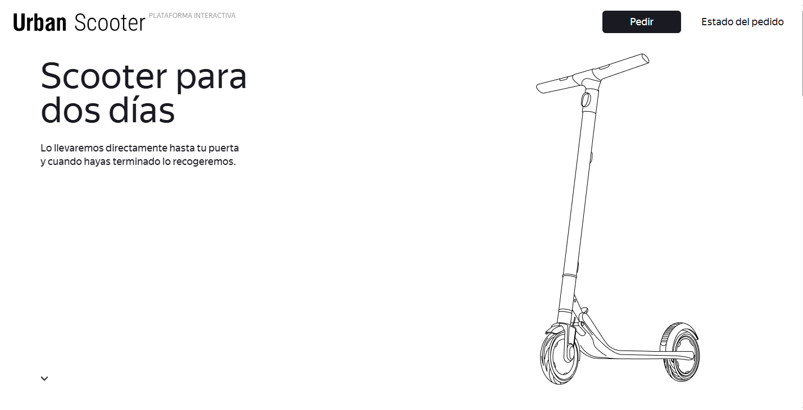
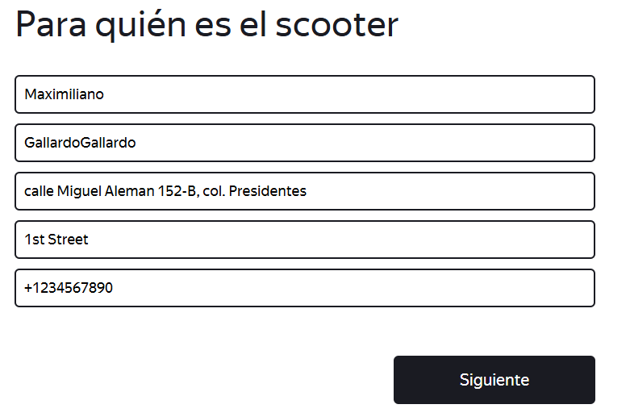
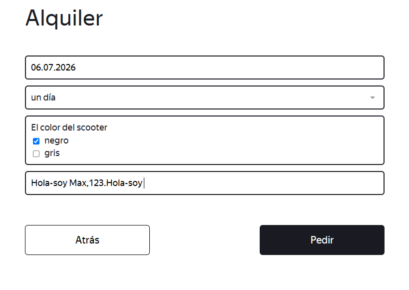
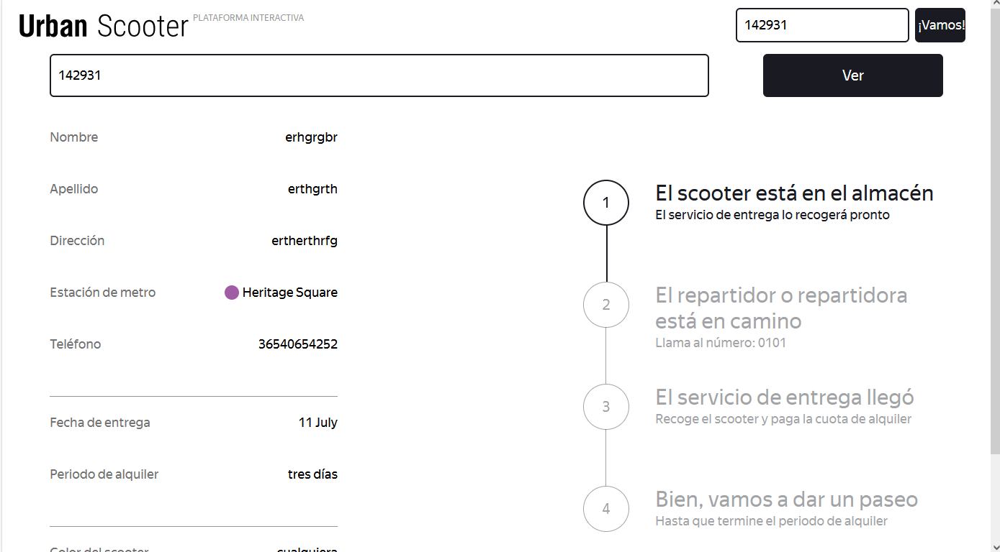
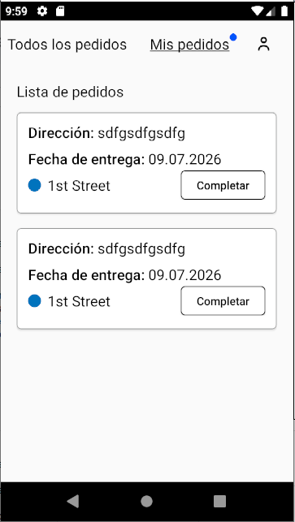
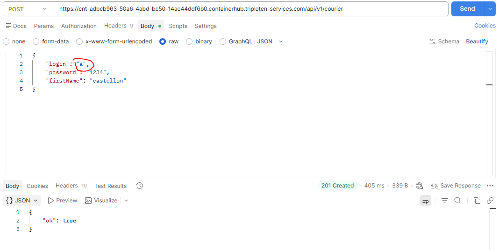
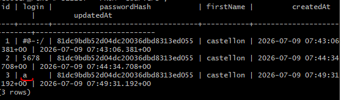

<h1>E2E-Manual-testing-project</h1>

  Proyecto completo de Testing E2E desde el plan, diseño y ejecución de casos de prueba que se puede observar en el archivo <code>test cases.xlsx</code>. El objetivo principal es crear un escenario real de una renta de un scooter via online, desde que el usuario hace el pedido hasta que el repartidor lo acepta desde una app móvil.

  Se ejecutaron pruebas manuales para la app web y Android Studio para la app móvil. También se desarrollaron algunas solicitudes en Postman para validar algunos requerimientos de la API, así como también consultas en PostgreSQL para validar algunos datos de la base de datos.

<h2>Estructura del archivo de test cases:</h2>

<h3>APP WEB (Usuarios)</h3>
<h4>Tarea 2:</h4>
<ul>
  <li><strong>Artefactos:</strong> Es un mapa mental el cual se utilizó como base para desarrollar la lista de comprobación y validación de datos.</li>
  <li><strong>Lista de comprobación:</strong> Son los escenarios positivos y negativos basados en los requisitos para la aplicación web.</li>
  <li><strong>Validación de datos:</strong> Es un análisis en el que se usó la metodología de valores límites y partición de clases para validar los escenarios positivos y negativos para la aplicación web.</li>
</ul>

<h3>APP MÓVIL (Repartidores)</h3>
<h4>Tarea 3:</h4>
<ul>
  <li><strong>Casos de prueba:</strong> Escenarios de pruebas manuales positivos y negativos para validar algunos requisitos de la app móvil para repartidores.</li>
</ul>

<h3>API y database:</h3>
<h4>Tarea 4:</h4>
<ul>
  <li><strong>Lista de comprobación:</strong> Escenarios positivos y negativos para validar los requisitos de la API y la base de datos para algunos escenarios en específico.</li>
</ul>

<h2>JIRA Reports:</h2>
<ul>
  <li><strong>Bugs de la app web:</strong> TFP-2 al TFP-15</li>
  <li><strong>Bugs de la app móvil:</strong> TFP-16 al TFP-26</li>
  <li><strong>Bugs de la API y base de datos:</strong> TFP-27 al TFP-43</li>
</ul>

<h2>Imagenes de referencia:</h2>
<h2>Imagenes de referencia:</h2>

<figure>
  <figcaption><strong>Pagina principal</strong></figcaption>
  
</figure>

<figure>
  <figcaption><strong>Formulario del alquiler 1</strong></figcaption>
  
</figure>

<figure>
  <figcaption><strong>Formulario del alquiler 2</strong></figcaption>
  
</figure>

<figure>
  <figcaption><strong>Pedido realizado</strong></figcaption>
  
</figure>

<figure>
  <figcaption><strong>App de repartidores</strong></figcaption>
  
</figure>

<figure>
  <figcaption><strong>Solicitud a la API</strong></figcaption>
  
</figure>

<figure>
  <figcaption><strong>Base de datos</strong></figcaption>
  
</figure>
